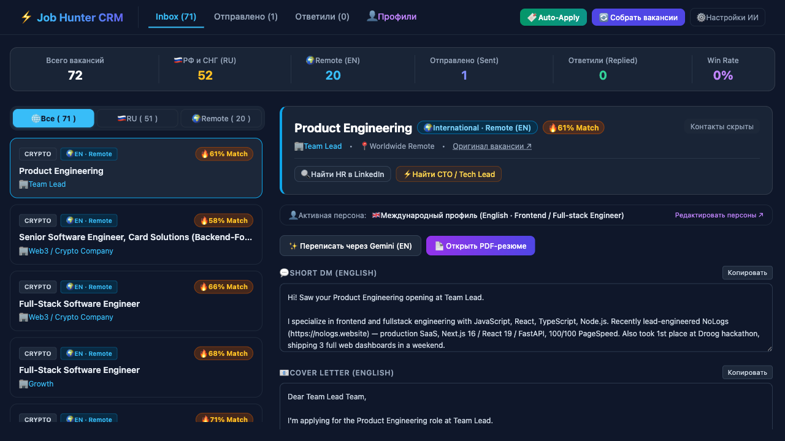
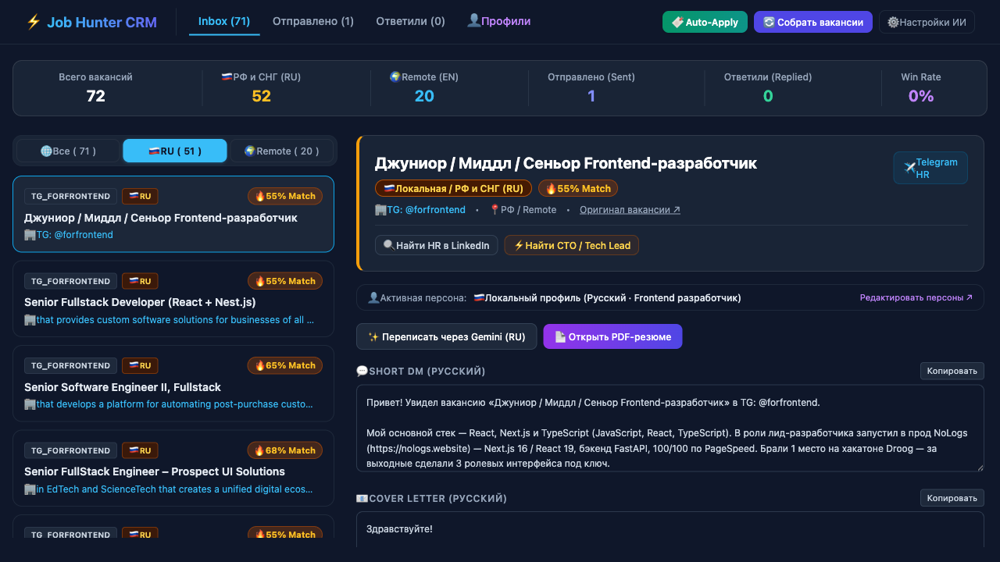

<div align="center">

# ⚡️ Job Hunter CRM

**Autonomous, local-first career assistant & pitch engine for engineers.**  
*Multi-source job scraper, Anti-BS filter, Gemini AI pitches & stealth auto-apply via browser bookmarklet.*

<br/>

[](LICENSE)
[](https://www.python.org/)
[](crm_v2_template.html)
[](#-tech-stack--architecture)
[](crm.py)

<br/>

**[English](#-english)** &nbsp;•&nbsp; **[Русский](#-русский)**

<br/>



</div>

---

# 🇬🇧 English

## 🎯 The Problem & The Solution

- **The Problem:** Job hunting in tech is exhausting. Developers waste dozens of hours copying and pasting details across multiple portals (HH.ru, LinkedIn, Habr Career, RemoteOK, Telegram), fighting HR "red flags" (unpaid 3-day test tasks, mandatory self-employment/tax evasion schemes), and writing custom cover letters by hand. Meanwhile, automated headless bots (Playwright/Selenium) get blocked within minutes by Cloudflare Turnstile, DataDome, and 2FA captchas.
- **The Solution:** A lightweight, local-first desktop CRM that aggregates vacancies across multiple sources, filters out HR bullshit, calculates tech stack match scores (0–100%), dynamically routes candidate personas (Russian vs. International Remote English), generates tailored pitches via AI, and auto-fills applications in 1 click right inside your authenticated browser context.

---

## 🚀 Key Features

### 1. 🌐 Multi-Source Harvester
- Aggregates tech vacancies across local and global platforms:
  - **CIS & Russian market:** Telegram channels, Habr Career, HH.ru.
  - **Global Remote market:** Remotive API, WeWorkRemotely, RemoteOK, CryptoJobsList.
- Seamless segmentation into **🇷🇺 Local (RU)** and **🌍 International Remote (EN)**.

### 2. 🛡 Anti-BS Filter
Automatically detects toxic job descriptions and flags recruiter red flags:
- 🚫 **Unpaid test assignments** required before the first interview.
- 🚫 **Mandatory self-employment** (ИП / самозанятость) masking employee roles.
- 🚫 **Unrealistic experience traps** (e.g. 5+ years for junior positions).

### 3. 👥 Multi-Persona Profiles & Resume Parser
- Store and switch candidate profiles (e.g., *Frontend Specialist* vs. *Fullstack / Team Lead*; *Russian* vs. *English*).
- Built-in local parser for PDF and DOCX resumes.

### 4. 🤖 AI Match & Pitch Generator
- Deterministic tech stack matching algorithms (0–100% score).
- Generates human-toned, high-impact **Short DMs** (for Telegram/LinkedIn cold outreach) and **Cover Letters** without robotic AI clichés.
- Integrated with Google Gemini API (`gemini-2.5-flash` / `gemini-flash-latest`) with automatic model fallback.

### 5. 🔖 Stealth Auto-Apply Bookmarklet
Why battle Cloudflare, DataDome, and 2FA with flaky headless browsers?
- The CRM compiles a **Smart JavaScript Bookmarklet** that you drag onto your browser's bookmarks bar.
- On any job posting page (HH.ru, LinkedIn, Greenhouse, etc.), simply click the bookmarklet:
  - It fetches your approved pitch directly from `http://localhost:8115/api/pitches`.
  - Heuristically detects input fields and textareas.
  - Injects your cover letter and dispatches native DOM input events within your **already authenticated session**.
  - **Zero bot detection, zero captchas.**

---

## 🛠 Tech Stack & Architecture

Built with a **zero-dependency, local-first** engineering philosophy:

| Layer | Technology | Rationale |
| :--- | :--- | :--- |
| **Backend** | Python 3.x (`http.server`, `sqlite3`, `urllib`) | Zero heavy frameworks, instant cold start, no package rot. |
| **Frontend** | Single-file Vanilla JS + Tailwind CSS (CDN) | Extremely fast, no npm build step required. |
| **Database** | SQLite (`jobs.db`) | 100% local data ownership, zero server config. |
| **AI Engine** | Google Gemini API | Low-latency, cost-effective structured reasoning. |
| **Automation** | Browser JS Bookmarklet | Immune to Cloudflare & bot detection. |

---

## 🏁 Quick Start

### 1. Clone & Configure
```bash
git clone https://github.com/heayr/job-hunter.git
cd job-hunter

# Set up local configuration from templates
cp config.example.json config.json
cp generator/profiles.example.json generator/profiles.json
```

Add your Gemini API Key to `config.json` (get a free key from [Google AI Studio](https://aistudio.google.com/)):
```json
{
  "gemini_api_key": "YOUR_GEMINI_API_KEY"
}
```

### 2. Launch CRM
```bash
./start.sh
```
Open **`http://localhost:8115`** in your browser.

### 3. Install Auto-Apply Bookmarklet
1. Drag the **«🔖 Auto-Apply»** button from the CRM navigation bar directly onto your browser's Bookmarks bar.
2. Open any vacancy page on HH.ru or LinkedIn.
3. Click the bookmarklet to auto-fill the application form in 1 second!

---

## 🧪 Testing

Run the automated test suite:
```bash
python3 -m unittest discover tests
```
All 20 unit tests verify scraper endpoints, database migrations, contact isolation, scoring logic, and market filtering.

---

# 🇷🇺 Русский

<div align="center">
  
</div>

<br/>

## 🎯 Проблема и Решение

- **Проблема:** Поиск работы в IT превратился в изматывающий рутинный ад. Разработчики тратят десятки часов на копипаст между десятками порталов (HH.ru, Хабр Карьера, LinkedIn, RemoteOK, Telegram-каналы), сталкиваются с токсичными требованиями HR (неоплачиваемые тестовые на неделю до первого звонка, принудительное ИП/самозанятость вместо ТК РФ) и вручную переписывают сопроводительные письма. Обычные боты на Playwright/Selenium моментально ловят баны от Cloudflare, DataDome и капчи.
- **Решение:** Автономная локальная CRM-система. Она агрегирует вакансии из множества источников, отсеивает неадекватные предложения, рассчитывает процент соответствия стеку (0–100%), переключает персоны кандидата (RU / EN) под конкретную вакансию, генерирует качественные отклики через ИИ и заполняет формы в 1 клик прямо в твоем браузере в обход антифрод-систем.

---

## 🚀 Ключевые возможности

### 1. 🌐 Мульти-парсер вакансий
- Агрегация IT-вакансий из ключевых площадок:
  - **РФ и СНГ:** Telegram-каналы, Хабр Карьера, HH.ru.
  - **Международный Remote:** Remotive API, WeWorkRemotely, RemoteOK, CryptoJobsList.
- Четкое разделение на рынки: **🇷🇺 РФ и СНГ (RU)** и **🌍 International Remote (EN)**.

### 2. 🛡 Anti-BS фильтр
Автоматически анализирует текст вакансии и подсвечивает красные флаги:
- 🚫 **Неоплачиваемое тестовое задание** до первого технического интервью.
- 🚫 **Серые схемы** с принудительным оформлением ИП/Самозанятости на фуллтайм.
- 🚫 **Абсурдные требования** (например, 5+ лет опыта на позицию джуниора).

### 3. 👥 Мульти-профили и локальный парсер резюме
- Хранение и мгновенное переключение профилей кандидата (например, *Frontend-разработчик* vs. *Fullstack / Тимлид*; *Русский* vs. *Английский*).
- Встроенный локальный парсер PDF и DOCX резюме.

### 4. 🤖 AI-мэтчинг и генератор питчей
- Детерминированный расчет совместимости по технологическому стеку (Match Score 0–100%).
- Генерация персонализированных **Short DM** (для прямого контакта с HR/CTO в Telegram и LinkedIn) и полных **Сопроводительных писем** без роботизированных штампов.
- Интеграция с Google Gemini API (`gemini-2.5-flash` / `gemini-flash-latest`) с автоматическим фолбэком моделей.

### 5. 🔖 Stealth автоотклик через Bookmarklet
Забудь о борьбе с капчами и Cloudflare через падающие headless-браузеры:
- CRM формирует **Умную JS-закладку (Bookmarklet)**, которую ты перетаскиваешь на панель закладок своего браузера.
- На странице любой вакансии (HH.ru, LinkedIn и др.) ты просто кликаешь на закладку:
  - Закладка подтягивает готовый отклик из локальной CRM (`http://localhost:8115/api/pitches`).
  - Находит поле ввода сопроводительного письма.
  - Вставляет текст и вызывает нативные события DOM внутри твоей **уже авторизованной сессии**.
  - **Никаких капчей, никаких блокировок ботов.**

---

## 🛠 Архитектурный манифест

Проект создан на базе философии **Zero-dependency & Local-first**:

| Слой | Технология | Почему именно так |
| :--- | :--- | :--- |
| **Backend** | Python 3.x (`http.server`, `sqlite3`, `urllib`) | Никаких тяжелых фреймворков. Мгновенный запуск за 1 секунду. |
| **Frontend** | Single-file Vanilla JS + Tailwind CSS (CDN) | Максимальная скорость, без монструозного `npm build`. |
| **База данных** | SQLite (`jobs.db`) | 100% приватность данных, всё хранится локально на машине. |
| **AI Engine** | Google Gemini API | Быстрый, дешевый и точный структурированный вывод. |
| **Автоматизация** | Браузерный JS Bookmarklet | Полный иммунитет к Cloudflare и защитам от ботов. |

---

## 🏁 Быстрый старт

### 1. Клонирование и настройка
```bash
git clone https://github.com/heayr/job-hunter.git
cd job-hunter

# Создание локальных конфигов из шаблонов
cp config.example.json config.json
cp generator/profiles.example.json generator/profiles.json
```

Укажи свой Gemini API Key в `config.json` (бесплатный ключ на [Google AI Studio](https://aistudio.google.com/)):
```json
{
  "gemini_api_key": "ТВОЙ_GEMINI_API_KEY"
}
```

### 2. Запуск CRM
```bash
./start.sh
```
Открой адрес **`http://localhost:8115`** в браузере.

### 3. Установка умной закладки
1. Перетащи кнопку **«🔖 Auto-Apply»** из шапки CRM на панель закладок своего браузера.
2. Открой страницу вакансии на HH.ru или LinkedIn.
3. Нажми на закладку — форма отклика заполнится за 1 секунду!

---

## 🧪 Тестирование

Запуск тестов:
```bash
python3 -m unittest discover tests
```
20 тестов проверяют работу парсеров, миграции БД, изоляцию контактов, расчет скоринга и фильтрацию по рынкам.

---

## 🤝 Вклад в проект (Contributing)

Пулл-реквесты, новые парсеры и идеи приветствуются! 

Если проект оказался полезен в твоем поиске работы — **поставь звезду ⭐ на GitHub**, это помогает проекту расти!

---

## 📄 Лицензия

Распространяется под лицензией **MIT**. Подробнее в файле [`LICENSE`](LICENSE).
