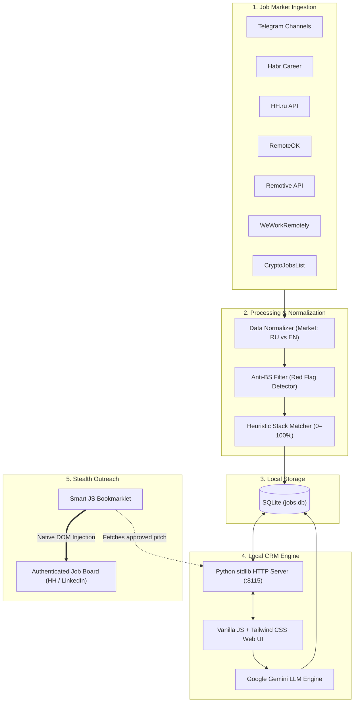

# 🏗 System Architecture

Job Hunter CRM is engineered with an uncompromising **local-first, zero-dependency** design philosophy. It is built to run autonomously on the user's machine without external database servers, cloud backends, or heavy compilation steps.

---

## 🧭 High-Level Data Flow

---

## 🏛 Core Architectural Decisions

### 1. Zero-Dependency Backend (Python Standard Library)
Instead of introducing FastAPI, Django, or Flask with dozens of transient dependencies:
- Built strictly on Python's built-in `http.server`, `sqlite3`, `urllib.request`, and `json`.
- **Advantages:** Instant cold start (<100ms), zero dependency rot over time, zero Docker overhead, and flawless cross-platform execution on macOS and Linux out of the box.

### 2. Single-File Vanilla JS Interface
- The entire CRM UI resides in `crm_v2_template.html` utilizing Vanilla JS and Tailwind CSS loaded via CDN.
- **Advantages:** No Node.js build pipelines (`webpack`, `vite`, `next`), no `node_modules` bloating your disk, and instant reactivity. Editing code immediately reflects on browser reload.

### 3. Local-First Data Sovereignty
- All candidate profiles, resumes, contact information, and scraped job records are stored in a local SQLite file (`jobs.db`).
- Nothing is sent to third-party tracking services or analytics servers. Your data stays 100% on your machine.

### 4. Smart Bookmarklet vs. Headless Browsers (ADR-005)
Most automated job application tools rely on Puppeteer, Playwright, or Selenium. In modern job hunting, this approach consistently fails because:
1. Job platforms (HH.ru, LinkedIn, Greenhouse, Lever) actively deploy **Cloudflare Turnstile, DataDome, and behavioral captchas** against headless Chrome instances.
2. Managing session cookies and bypassing 2FA on every run is brittle and leads to account bans.

**The Solution:**
Job Hunter uses a **JavaScript Bookmarklet**:
- The bookmarklet executes directly inside the user's **already-authenticated browser tab**.
- When clicked, it queries the local CRM REST API (`http://localhost:8115/api/pitches`), identifies the active job application form, and dispatches native DOM `input` and `change` events.
- **Result:** 100% immune to anti-bot protections, zero captchas, and 1-second application submission.

---

## 🗄 Database Schema

The local SQLite database (`jobs.db`) comprises two core tables:

### `vacancies`
| Column | Type | Description |
| :--- | :--- | :--- |
| `id` | TEXT PRIMARY KEY | Unique MD5 hash based on URL/title/company |
| `title` | TEXT | Job position title |
| `company` | TEXT | Hiring company name |
| `url` | TEXT | Direct URL to vacancy posting |
| `description` | TEXT | Full job description text |
| `market` | TEXT | Market identifier (`ru` for CIS/Local, `en` for International Remote) |
| `score` | INTEGER | Match score (0–100%) |
| `status` | TEXT | Application status (`inbox`, `sent`, `replied`, `rejected`) |
| `created_at` | TIMESTAMP | Ingestion timestamp |

### `pitches`
| Column | Type | Description |
| :--- | :--- | :--- |
| `id` | INTEGER PRIMARY KEY | Autoincrement pitch ID |
| `vacancy_id` | TEXT | Foreign key referencing `vacancies(id)` |
| `pitch_type` | TEXT | `short_dm`, `cover_letter`, or `tailored_cv` |
| `language` | TEXT | Language code (`ru` or `en`) |
| `content` | TEXT | Human-toned pitch text |
| `status` | TEXT | `DRAFT`, `APPROVED`, or `SENT` |
