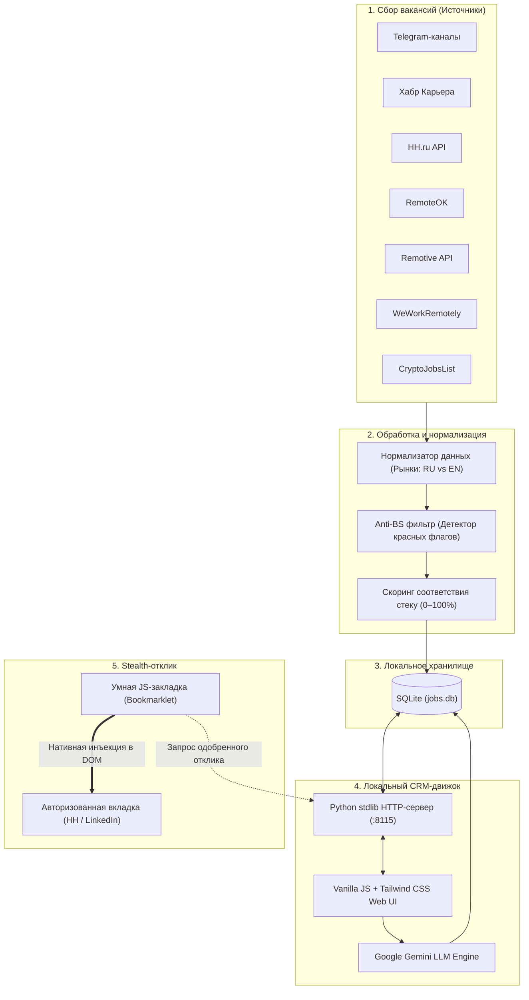

# 🏗 Системная архитектура

**[English](../ARCHITECTURE.md)** &nbsp;•&nbsp; **[Русский](ARCHITECTURE.md)**

Job Hunter CRM спроектирован с упором на бескомпромиссную философию **Local-first и Zero-dependency**. Система работает полностью автономно на компьютере пользователя без внешних серверов баз данных, облачных бэкендов и тяжелых шагов сборки.

---

## 🧭 Высокоуровневая диаграмма потоков данных

---

## 🏛 Ключевые архитектурные решения

### 1. Бэкенд с нулевыми зависимостями (Стандартная библиотека Python)
Вместо подключения FastAPI, Django или Flask с десятками транзитивных пакетов:
- Сервер написан исключительно на встроенных модулях Python: `http.server`, `sqlite3`, `urllib.request` и `json`.
- **Преимущества:** Мгновенный холодный старт (<100мс), отсутствие устаревания зависимостей со временем, никакого Docker-оверхеда и гарантированная работа на любой версии macOS и Linux из коробки.

### 2. Одностраничный интерфейс на чистом Vanilla JS
- Весь веб-интерфейс находится в файле `crm_v2_template.html`, использует нативный JavaScript и Tailwind CSS через CDN.
- **Преимущества:** Никаких сборщиков (`webpack`, `vite`, `next`), никаких гигабайтов `node_modules` на диске и мгновенная отзывчивость. Любые изменения в коде видны сразу после перезагрузки страницы (F5).

### 3. Полный суверенитет данных (Local-First)
- Профили кандидата, резюме, контактные данные и база вакансий хранятся строго в локальном SQLite файле (`jobs.db`).
- Никакие данные не отправляются на сторонние серверы аналитики или телеметрии. Вся информация остается на вашей машине.

### 4. Умный букмарклет вместо Headless-браузеров (ADR-005)
Большинство инструментов для автооткликов используют Puppeteer, Playwright или Selenium. В современных реалиях этот подход гарантированно проваливается:
1. Крупные порталы (HH.ru, LinkedIn, Greenhouse, Lever) используют защиту **Cloudflare Turnstile, DataDome и поведенческие капчи**, которые моментально вычисляют headless Chrome.
2. Проброс сессионных кук и двухфакторная аутентификация (2FA) приводят к постоянным ошибкам и банам аккаунтов.

**Наше решение:**
Job Hunter использует **JavaScript Bookmarklet**:
- Закладка запускается напрямую в **уже авторизованной вкладке браузера самого пользователя**.
- По клику она обращается к локальному REST API CRM (`http://localhost:8115/api/pitches`), определяет активную форму отклика, вставляет сгенерированный текст и инициирует нативные браузерные события DOM `input` и `change`.
- **Результат:** 100% иммунитет к защитам от ботов, ноль капчей и отправка отклика за 1 секунду.

---

## 🗄 Схема базы данных

Локальная база данных SQLite (`jobs.db`) состоит из двух ключевых таблиц:

### `vacancies` (Вакансии)
| Колонка | Тип | Описание |
| :--- | :--- | :--- |
| `id` | TEXT PRIMARY KEY | Уникальный MD5-хэш на основе URL/названия/компании |
| `title` | TEXT | Название позиции |
| `company` | TEXT | Название компании-работодателя |
| `url` | TEXT | Прямая ссылка на страницу вакансии |
| `description` | TEXT | Полный текст описания вакансии |
| `market` | TEXT | Рынок (`ru` — РФ/СНГ, `en` — International Remote) |
| `score` | INTEGER | Процент совпадения со стеком (0–100%) |
| `status` | TEXT | Статус отклика (`inbox`, `sent`, `replied`, `rejected`) |
| `created_at` | TIMESTAMP | Дата и время сбора вакансии |

### `pitches` (Сгенерированные отклики)
| Колонка | Тип | Описание |
| :--- | :--- | :--- |
| `id` | INTEGER PRIMARY KEY | Автоинкрементный ID отклика |
| `vacancy_id` | TEXT | Внешний ключ на `vacancies(id)` |
| `pitch_type` | TEXT | Тип отклика: `short_dm`, `cover_letter` или `tailored_cv` |
| `language` | TEXT | Язык (`ru` или `en`) |
| `content` | TEXT | Текст отклика, адаптированный под вакансию |
| `status` | TEXT | Статус (`DRAFT`, `APPROVED` или `SENT`) |
